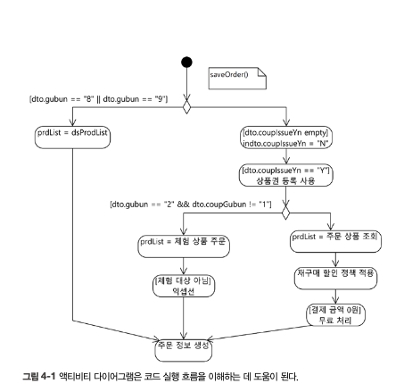
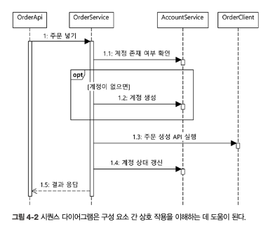
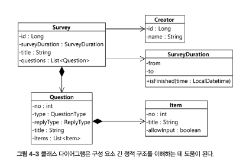
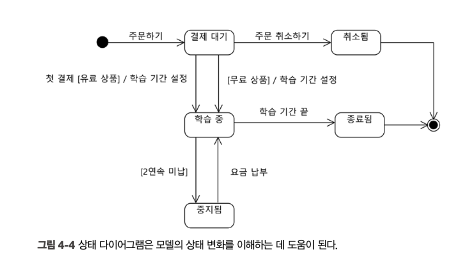

### 코드 시각화
> UML (Unified Modeling Language)

---
* 액티비티 다이어그램

  
---
* 시퀀스 다이어그램

    
---
* 클래스 다이어그램

    
---
* 상태 다이어그램

    

### 스크래치 리팩터링
---
- 분석을 목적으로하는 리팩터링
- 변수이름변경, 메서드 추출, 파라미터타입 변경과 같은 수정을 하면서 코드 동작을 깊이 이해함.
- ***이해가 목적이므로 결과는 반영하지 않고 다시 원래대로 돌린다.***

### 이해하기 좋은 코드
---
* 이름: 의미나 의도, 목적을 유추할 수 있는 이름
* 중첩if 최소화
* 변수줄이기
* 값변경 최소화하기(불변, immutable)
* 알맞은 파라미터 타입사용하기
* 길지 않은 코드와 메서드추출
* 추상화 수준 맞추기
* 